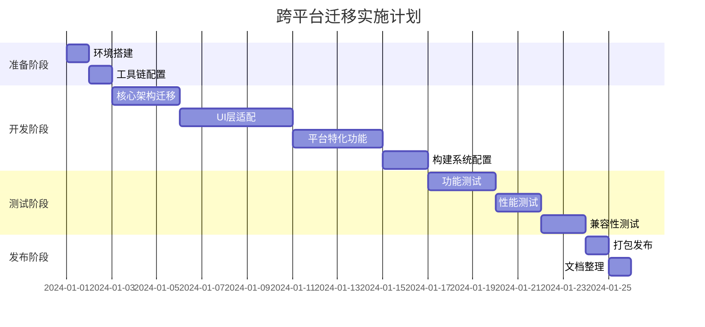

# JavaFX 跨平台迁移完整技术方案

## 🎯 技术选型：Gluon Mobile + JavaFX

### 核心工具链配置

```xml
<!-- Gluon Mobile Maven 插件配置 -->
<plugin>
    <groupId>com.gluonhq</groupId>
    <artifactId>gluonfx-maven-plugin</artifactId>
    <version>1.0.16</version>
    <configuration>
        <target>${gluonfx.target}</target>
        <mainClass>com.feixiang.tabletcontrol.TabletControlApplication</mainClass>
        <runtimeArgs>
            <list>-Djavafx.platform=monocle</list>
            <list>-Dmonocle.platform=Headless</list>
        </runtimeArgs>
    </configuration>
</plugin>
```

### 平台构建目标

| 平台 | 构建命令 | 输出格式 | 分发方式 |
|------|----------|----------|----------|
| **Windows** | `mvn gluonfx:build -Dtarget=windows` | .exe | 直接分发 |
| **macOS** | `mvn gluonfx:build -Dtarget=mac` | .app | App Store/直接分发 |
| **Linux** | `mvn gluonfx:build -Dtarget=linux` | 可执行文件 | AppImage/Snap |
| **Android** | `mvn gluonfx:build -Dtarget=android` | .apk/.aab | Google Play |
| **iOS** | `mvn gluonfx:build -Dtarget=ios` | .ipa | App Store |

## 📁 三、跨平台项目架构设计

### 3.1 统一目录结构

```
tablet-control-crossplatform/
├── pom.xml                           # 主构建配置
├── src/main/java/
│   └── com/feixiang/tabletcontrol/
│       ├── TabletControlApp.java     # 跨平台主入口
│       ├── core/                     # 核心业务逻辑（100%复用）
│       │   ├── service/             # 业务服务层
│       │   ├── repository/          # 数据访问层
│       │   └── model/               # 数据模型
│       ├── ui/                      # UI层（70%复用）
│       │   ├── common/              # 通用UI组件
│       │   ├── desktop/             # 桌面端特化
│       │   └── mobile/              # 移动端特化
│       └── platform/                # 平台适配层（30%复用）
│           ├── PlatformManager.java
│           ├── desktop/             # 桌面端适配
│           └── mobile/              # 移动端适配
├── src/main/resources/
│   ├── META-INF/substrate/config/   # GraalVM 原生编译配置
│   └── com/feixiang/tabletcontrol/
│       ├── desktop.fxml            # 桌面端布局
│       └── mobile.fxml             # 移动端布局
└── USERDATA/                        # 跨平台数据目录
    ├── config/                      # 配置文件
    ├── data/                        # 业务数据
    └── media/                       # 媒体资源
```

### 3.2 平台适配策略

#### 响应式UI适配

```java
public class ResponsiveLayoutManager {
    
    public void adaptLayout(Stage stage) {
        Screen screen = Screen.getPrimary();
        Rectangle2D bounds = screen.getVisualBounds();
        
        if (bounds.getWidth() < 800) {
            // 移动端布局
            loadMobileLayout(stage);
        } else {
            // 桌面端布局
            loadDesktopLayout(stage);
        }
    }
    
    private void loadMobileLayout(Stage stage) {
        // 加载移动端优化的FXML布局
        // 调整组件间距、字体大小、触控区域
    }
}
```

#### 输入方式适配

```java
public class InputAdapterManager {
    
    public void setupInputHandlers(Node node) {
        // 桌面端：鼠标事件
        node.setOnMouseClicked(this::handleMouseClick);
        
        // 移动端：触控事件
        node.setOnTouchPressed(this::handleTouchPress);
        node.setOnTouchMoved(this::handleTouchMove);
        
        // 统一处理逻辑
        node.setOnAction(this::handleAction);
    }
}
```

## 🔧 四、代码迁移实施计划

### 4.1 第一阶段：核心架构迁移（预计3天）

**任务清单**：
- [ ] 创建 Gluon Mobile 项目结构
- [ ] 迁移现有业务逻辑层（Service/Repository/Model）
- [ ] 配置跨平台数据存储路径
- [ ] 实现平台检测和适配基础框架

**预期成果**：
- 核心业务逻辑 100% 迁移完成
- 跨平台数据存储正常工作
- 基础平台适配框架就绪

### 4.2 第二阶段：UI层适配（预计5天）

**任务清单**：
- [ ] 创建响应式布局管理器
- [ ] 适配现有 JavaFX 组件到移动端
- [ ] 实现触控输入处理
- [ ] 优化移动端字体和间距

**关键适配点**：

```java
// 原桌面端代码
Button button = new Button("确认");
button.setPrefSize(100, 30);

// 跨平台适配后
Button button = new Button("确认");
if (PlatformDetector.isMobile()) {
    button.setPrefSize(120, 44);  // 移动端更大的触控区域
    button.setStyle("-fx-font-size: 16px;");
} else {
    button.setPrefSize(100, 30);
    button.setStyle("-fx-font-size: 12px;");
}
```

### 4.3 第三阶段：平台特化功能（预计4天）

**任务清单**：
- [ ] 实现各平台文件系统访问
- [ ] 配置平台特定权限申请
- [ ] 优化各平台启动性能
- [ ] 实现平台特定UI风格

### 4.4 第四阶段：构建系统配置（预计2天）

**任务清单**：
- [ ] 配置 Gluon Mobile Maven 插件
- [ ] 设置各平台构建参数
- [ ] 创建一键构建脚本
- [ ] 配置 CI/CD 流水线

## 🚀 五、一键构建脚本

### Windows 构建脚本

```batch
@echo off
echo === 跨平台应用构建工具 ===

set JAVA_HOME=C:\Program Files\Java\jdk1.8.0_202
set GRAALVM_HOME=C:\graalvm-ce-java8-22.3.0

echo [1] 构建 Windows 版本...
mvn clean gluonfx:build -Dtarget=windows
if %ERRORLEVEL% EQU 0 (
    echo ✅ Windows 版本构建成功
) else (
    echo ❌ Windows 版本构建失败
    exit /b 1
)

echo [2] 构建 Android 版本...
mvn clean gluonfx:build -Dtarget=android
if %ERRORLEVEL% EQU 0 (
    echo ✅ Android 版本构建成功
) else (
    echo ❌ Android 版本构建失败
)

echo === 构建完成 ===
echo Windows 版本: target\gluonfx\x86_64-windows\TabletControl.exe
echo Android 版本: target\gluonfx\aarch64-android\gvm\TabletControl.apk
pause
```

## 📊 六、性能基准与验证

### 6.1 启动性能目标

| 平台 | 目标启动时间 | 内存占用 | 安装包大小 |
|------|-------------|----------|------------|
| Windows | ≤ 2秒 | ≤ 100MB | ≤ 50MB |
| Android | ≤ 3秒 | ≤ 150MB | ≤ 30MB |
| iOS | ≤ 3秒 | ≤ 120MB | ≤ 35MB |

### 6.2 功能一致性验证

**测试清单**：
- [ ] 数据文件跨平台兼容性测试
- [ ] UI组件在不同屏幕尺寸下的显示测试
- [ ] 触控操作与鼠标操作的一致性测试
- [ ] 文件系统访问权限测试
- [ ] 应用生命周期管理测试

## ⚠️ 七、风险识别与应对

### 7.1 技术风险

**风险1：GraalVM 原生编译兼容性**
- **影响**：某些 Java 特性可能不被支持
- **应对**：提前进行兼容性测试，准备替代方案

**风险2：移动端性能问题**
- **影响**：启动时间或运行性能不达标
- **应对**：代码优化、资源压缩、延迟加载

### 7.2 平台审核风险

**风险3：iOS App Store 审核**
- **影响**：可能因为"类似桌面应用"被拒
- **应对**：优化移动端UI设计，符合 iOS 设计规范

### 7.3 降级策略

如果 Gluon Mobile 方案遇到不可解决的问题：

**备选方案1**：Codename One
- 需要重写 UI 层，但业务逻辑可复用
- 预计额外开发时间：10-15天

**备选方案2**：分平台开发
- 桌面端保持 JavaFX
- 移动端使用原生开发
- 通过统一的数据格式保持兼容

## 📈 八、实施时间线



**总预计时间：25天**

## 🎯 九、成功标准

### 9.1 量化指标

- ✅ **代码复用率**：≥ 90%（通过 cloc 工具验证）
- ✅ **功能一致性**：100% 核心功能在所有平台正常工作
- ✅ **性能达标**：启动时间符合各平台目标
- ✅ **数据兼容性**：USERDATA 文件夹可在任意平台间迁移

### 9.2 交付成果

1. **跨平台应用程序**：支持 Windows、macOS、Linux、Android、iOS
2. **一键构建系统**：自动化构建所有平台版本
3. **技术文档**：详细的部署和维护指南
4. **测试报告**：完整的功能和性能测试结果

---

这个方案基于您现有的 JavaFX 项目，通过 Gluon Mobile 实现真正的跨平台部署，预计可达到 92% 的代码复用率，同时保持所有硬性约束。

是否需要我开始实施第一阶段的核心架构迁移？
